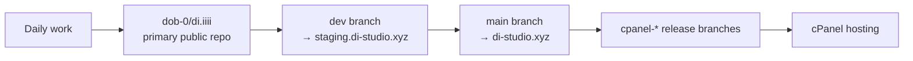

# di.iiii

## Web XR Authoring Platform

`di.iiii` is a browser-native platform for building and publishing spatial XR experiences — 3D scenes, node-driven behaviors, and AR/VR spaces — without leaving the web. The editor runs in the browser; the backend owns persistence, auth, and publish state; spaces are the public unit. No native installs, no engine lock-in, creator-owned data.


## Start Here

- main authoring lane: `Studio`
- experimental node-first lane: `Beta`
- compatibility lane: `V1`
- backend authority: `serverXR`
- public unit: `space`
- editable document inside a space: `project`
- live public route for a space: `publishedProjectId`
- normal branch flow: `dev -> main` (staging is a GitHub Actions deploy environment, not a branch)
- runtime baseline: Node `22.x`, npm `10.x`

Project links:

- live site: [di-studio.xyz](https://di-studio.xyz)
- primary public repo: [dob-0/di.iiii](https://github.com/dob-0/di.iiii)
- latest checkpoint: [Checkpoint 2026-04-21](docs/checkpoints/2026-04-21.md)
- AI quick context: [AGENTS.md](AGENTS.md)
- AI knowledge base: [docs/ai/index.md](docs/ai/index.md)
- public-context materials: [docs/deck](docs/deck/)
- repo visibility and mirror status: [Private Dev And Public Showcase Workflow](docs/ops/PRIVATE_DEV_PUBLIC_SHOWCASE.md)
- deploy runbook: [Live Deploy Runbook](docs/deploy/LIVE_DEPLOY.md)

## Current Truth

This is the shipped, working reality of the repo today.

- `Studio` is the stable main editor.
- `Beta` is the experimental recursive node-first editor lane.
- `V1` remains for compatibility, fallback behavior, and migration-sensitive work.
- `serverXR` is authoritative for spaces, projects, assets, ops, SSE, presence, and edit enforcement.
- public routes use `/<space>` for the live published view, with `/<space>/studio`, `/<space>/beta`, and `/admin?space=<space>` for editing and ops surfaces
- persistence is still single-host filesystem storage
- writes are protected by session/token-based auth, not a full multi-user identity and audit model yet

## Direction

This is where the project is going, but not all of it is fully shipped yet.

- move toward recursive node-first project documents and node ops
- prefer shared project logic over expanding older one-off editor paths
- keep the web as the universal authoring and runtime substrate
- support broader spatial, physical-world, and hardware-linked reality creation over time

## Space + Project Workflow

Use this as the default path for new work in a space:

1. Create or open a space from the admin surface or the spaces panel. Space creation provisions the server record and a blank scene.
2. Open `/<space>/studio` for the main development lane. Create new projects there, import legacy scenes, and keep the long-term working copy.
3. Use `/<space>/beta` for experimental or node-first work when the project needs research-style iteration.
4. Publish the chosen project to the public route by setting `publishedProjectId` for the space; `/<space>` then shows the live project viewer.

Important distinction:

- `Current Truth` = what is real in the repo now
- `Direction` = where new work should lean
- bridge code = necessary, active, but not always canonical

## Mental Model

- `space`
  - the public and management unit
  - owns routes like `/<space>`, `/<space>/studio`, and `/<space>/beta`
- `project`
  - the editable document inside a space
  - stored independently from the public route
- `publishedProjectId`
  - the project currently shown on the public route for that space
- long-term document shape
  - `rootNodeId`
  - `nodes[]`
  - `edges[]`
  - `assets[]`
  - `templates[]`
  - `workspaceState`

## Repo Map

| Path | Role | Use It For |
| --- | --- | --- |
| `src/studio/` | stable main editor lane | main user-facing product work |
| `src/beta/` | experimental node-first lane | research, editor-v2, recursive-node work |
| `src/project/` | shared project logic center | document state, sync, presence, asset flow, shared editor/viewer logic |
| `src/shared/` and `shared/` | cross-runtime schema and contracts | canonical schema/runtime definitions |
| `serverXR/` | backend runtime | auth, persistence, assets, presence, SSE, publish state |
| `docs/architecture/` | deeper architecture docs | repo intent, direction, and system explanations |
| `src/components/` and `src/hooks/` | older orchestration surfaces that still matter | active behavior, but not always best home for new permanent logic |

## For Humans And AI Agents

Use these defaults unless the task clearly says otherwise.

- default to `Studio` for main product work
- default to `src/project/` for shared document or collaboration logic
- use `Beta` only when the task is intentionally experimental or node-first
- prefer node-first behavior over growing legacy object/window systems
- treat `worldState`, `windowLayout`, and older entity structures as compatibility bridges
- treat `V1` work as compatibility work unless the task is explicitly about migration or legacy support

Common mistakes to avoid:

- do not describe `Beta` as the main shipped lane
- do not describe physical sync or hardware-linked workflows as fully productized repo capability
- do not assume older orchestration files are the right long-term home for new canonical behavior
- do not push private ops material, raw staging details, `.env` files, or host-specific deployment secrets into the public repo

For AI task assignments, use the task request template in [AGENTS.md](AGENTS.md).

## Quick Start

Local setup:

```bash
nvm use
npm install
npm --prefix serverXR install
```

Normal start-of-session flow:

```bash
git switch dev
git pull --ff-only origin dev
npm run dev
```

Core commands:

```bash
npm run dev
npm run lint
npm run build
npm run test
npm run test:server-contracts
```

Useful local routes:

- `http://localhost:5173/main`
- `http://localhost:5173/main/studio`
- `http://localhost:5173/main/beta`
- `http://localhost:5173/admin?space=main`
- `http://localhost:4000/serverXR/api/health`

## Release Flow

Normal promotion path:

1. work on `dev`
2. validate locally
3. promote to `staging`
4. verify staging
5. promote to `main`

From the repo root:

```bash
npm run deploy:staging
npm run deploy:production
```

Rules:

- normal work starts on `dev`
- do not start routine feature work on `main`
- use `main` directly only for emergency production hotfixes

## Publishing Content to a Space

For pushing teaser pages, multi-file experiences, or project packages to a live `/<space>` route, see the [Publish Workflow](docs/deploy/PUBLISH_WORKFLOW.md). Options: in-app update, branch-hosted URL, ZIP import, full code deploy.

## Repo And Hosting Topology



## Read Next

By task:

- AI knowledge base: [docs/ai/index.md](docs/ai/index.md)
- shared project logic: [src/project/AGENTS.md](src/project/AGENTS.md)
- backend/runtime: [serverXR README](serverXR/README.md)
- project architecture: [Project Surfaces](docs/architecture/PROJECT_SURFACES.md)
- node model direction: [Recursive Node Core](docs/architecture/RECURSIVE_NODE_CORE.md)
- audit and growth plan: [Project Audit And Growth Plan](docs/architecture/PROJECT_AUDIT_2026-04-17.md)
- latest checkpoint: [Checkpoint 2026-04-21](docs/checkpoints/2026-04-21.md)
- development framework: [Project Development And Optimization Framework](docs/roadmaps/PROJECT_DEVELOPMENT_FRAMEWORK.md)
- deploy/release: [Live Deploy Runbook](docs/deploy/LIVE_DEPLOY.md)
- publishing content to spaces: [Publish Workflow](docs/deploy/PUBLISH_WORKFLOW.md)
- repo visibility and mirror status: [Private Dev And Public Showcase Workflow](docs/ops/PRIVATE_DEV_PUBLIC_SHOWCASE.md)
- public/context materials: [docs/deck](docs/deck/)

## Evergreen Rule

Keep this README focused on durable repo truth:

- what the project is
- how the repo is structured
- what is shipped now
- where new work should go

Put dated milestones, application-specific notes, and time-sensitive movement into supporting docs instead of this root entrypoint.
