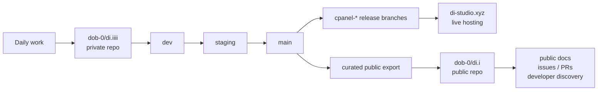

# di.i

## Web XR Node-Based Reality Creation Language

`di.i` is a web-based XR authoring platform for building spaces, projects, media, and node-driven behaviors on the web. This private repo, `dob-0/di.iiii`, is the active working and deployment source of truth. The public repo, `dob-0/di.i`, is the curated public-facing mirror and contributor front door.

## Start Here

- main authoring lane: `Studio`
- experimental node-first lane: `Beta`
- compatibility lane: `V1`
- backend authority: `serverXR`
- public unit: `space`
- editable document inside a space: `project`
- live public route for a space: `publishedProjectId`
- normal branch flow: `dev -> staging -> main`
- runtime baseline: Node `22.x`, npm `10.x`

Project links:

- live site: [di-studio.xyz](https://di-studio.xyz)
- public repo: [dob-0/di.i](https://github.com/dob-0/di.i)
- private repo: [dob-0/di.iiii](https://github.com/dob-0/di.iiii)
- latest checkpoint: [Checkpoint 2026-04-21](docs/checkpoints/2026-04-21.md)
- AI quick context: [AGENTS.md](AGENTS.md)
- AI knowledge base: [docs/ai/index.md](docs/ai/index.md)
- public-context materials: [docs/deck](docs/deck/)
- public/private workflow: [Private Dev And Public Showcase Workflow](docs/ops/PRIVATE_DEV_PUBLIC_SHOWCASE.md)
- deploy runbook: [Live Deploy Runbook](docs/deploy/LIVE_DEPLOY.md)

## Current Truth

This is the shipped, working reality of the repo today.

- `Studio` is the stable main editor.
- `Beta` is the experimental recursive node-first editor lane.
- `V1` remains for compatibility, fallback behavior, and migration-sensitive work.
- `serverXR` is authoritative for spaces, projects, assets, ops, SSE, presence, and edit enforcement.
- public routes use `/<space>` for the live published view, with `/<space>/studio`, `/<space>/beta`, and `/admin?space=<space>` for editing and ops surfaces
- persistence is still single-host filesystem storage
- writes are protected by session/token-based auth, not a full multi-user identity and audit model yet

## Direction

This is where the project is going, but not all of it is fully shipped yet.

- move toward recursive node-first project documents and node ops
- prefer shared project logic over expanding older one-off editor paths
- keep the web as the universal authoring and runtime substrate
- support broader spatial, physical-world, and hardware-linked reality creation over time

Important distinction:

- `Current Truth` = what is real in the repo now
- `Direction` = where new work should lean
- bridge code = necessary, active, but not always canonical

## Mental Model

- `space`
  - the public and management unit
  - owns routes like `/<space>`, `/<space>/studio`, and `/<space>/beta`
- `project`
  - the editable document inside a space
  - stored independently from the public route
- `publishedProjectId`
  - the project currently shown on the public route for that space
- long-term document shape
  - `rootNodeId`
  - `nodes[]`
  - `edges[]`
  - `assets[]`
  - `templates[]`
  - `workspaceState`

## Repo Map

| Path | Role | Use It For |
| --- | --- | --- |
| `src/studio/` | stable main editor lane | main user-facing product work |
| `src/beta/` | experimental node-first lane | research, editor-v2, recursive-node work |
| `src/project/` | shared project logic center | document state, sync, presence, asset flow, shared editor/viewer logic |
| `src/shared/` and `shared/` | cross-runtime schema and contracts | canonical schema/runtime definitions |
| `serverXR/` | backend runtime | auth, persistence, assets, presence, SSE, publish state |
| `docs/architecture/` | deeper architecture docs | repo intent, direction, and system explanations |
| `src/components/` and `src/hooks/` | older orchestration surfaces that still matter | active behavior, but not always best home for new permanent logic |

## For Humans And AI Agents

Use these defaults unless the task clearly says otherwise.

- default to `Studio` for main product work
- default to `src/project/` for shared document or collaboration logic
- use `Beta` only when the task is intentionally experimental or node-first
- prefer node-first behavior over growing legacy object/window systems
- treat `worldState`, `windowLayout`, and older entity structures as compatibility bridges
- treat `V1` work as compatibility work unless the task is explicitly about migration or legacy support
- do not treat the public repo `di.i` as the deploy source of truth

Common mistakes to avoid:

- do not describe `Beta` as the main shipped lane
- do not describe physical sync or hardware-linked workflows as fully productized repo capability
- do not assume older orchestration files are the right long-term home for new canonical behavior
- do not push private ops material, raw staging details, `.env` files, or host-specific deployment secrets into the public repo

### Task Request Template (Use This For AI Work)

Use this structure when assigning AI tasks to avoid extra edits, extra tool usage, or wrong priority:

- goal: one exact outcome
- priority: 1, 2, 3 (highest to lowest)
- scope: allowed files/folders only
- non-goals: explicit exclusions
- constraints: performance, security, style, or API rules
- output: expected response format/length
- done criteria: objective checks (tests, behavior, lint)

Strict add-ons (recommended):

- clarify limit: ask max 2 questions, then proceed safely
- scope lock: do not edit outside listed files/folders
- output contract: summary + changed files + validation + risks only
- progress bar: `status | phase X/Y | XX% | current | next`

Example:

- goal: fix project restore bug for missing assets
- priority: correctness first, then minimal diff, then tests
- scope: `src/project/`, `serverXR/src/assetRoutes.js`
- non-goals: no UI refactor, no schema changes
- constraints: keep current API shape and auth behavior
- output: short summary + changed files + validation result
- done criteria: missing assets no longer crash restore, tests pass

Copy-paste strict template:

- goal: ...
- priority: 1) ... 2) ... 3) ...
- scope: ...
- non-goals: ...
- constraints: ...
- clarify limit: ask max 2 questions
- scope lock: do not edit outside scope
- output contract: summary + changed files + validation + risks
- progress bar: status | phase X/Y | XX% | current | next
- done criteria: ...

## Quick Start

Local setup:

```bash
nvm use
npm install
npm --prefix serverXR install
```

Normal start-of-session flow:

```bash
git switch dev
git pull --ff-only origin dev
npm run dev
```

Core commands:

```bash
npm run dev
npm run lint
npm run build
npm run test
npm run test:server-contracts
```

Useful local routes:

- `http://localhost:5173/`
- `http://localhost:5173/main`
- `http://localhost:5173/main/studio`
- `http://localhost:5173/main/beta`
- `http://localhost:5173/admin?space=main`
- `http://localhost:4000/serverXR/api/health`

## Release Flow

Normal promotion path:

1. work on `dev`
2. validate locally
3. promote to `staging`
4. verify staging
5. promote to `main`

From the repo root:

```bash
npm run deploy:staging
npm run deploy:production
```

Rules:

- normal work starts on `dev`
- do not start routine feature work on `main`
- use `main` directly only for emergency production hotfixes

## Extended Experience Deploy (Manual + Branch)

For single-page teaser updates, use the in-app presentation tools.
For larger experiences (multiple assets/files), prefer branch/versioned deploys over ZIP handoffs.

### Visual quality checklist (public teaser pages)

Before publishing a teaser page on `/<space>`:

1. Fill the full viewport (`100vh`) and avoid empty black regions.
2. Keep one strong headline, one core concept line, and one platform relation block.
3. Ensure mobile readability (single-column fallback below ~920px).
4. Keep contrast high and type large enough for projection/screen capture.
5. Include explicit relation text:
  - `di.ii` = open-source XR platform
  - `br_id_ge` = project built on di.ii
6. Verify on staging before promotion.

### Option A: Manual in-app update (fast teaser changes)

Use this when updating copy, layout, or quick visual HTML for a live public route.

1. Open `/<space>/studio/projects/<projectId>`.
2. Open `Present`.
3. Set `Public entry view` to `Code view` (or `Fixed camera` / `3D scene` as needed).
4. Update `Code preview HTML` and verify the result on `/<space>`.

Notes:

- This is best for rapid content iteration.
- Keep this path for lightweight updates, not full application deployments.

### Option B: Branch + URL source workflow (recommended for multi-file content)

Use this when the experience has multiple files, custom scripts/styles, or needs repeatable updates.

1. Build and host the experience from a versioned branch/release path.
2. In Studio `Present`, keep `Public entry view` as `Code view` and set the source to the hosted URL (or embed a stable iframe wrapper).
3. Validate on `staging` and then promote through normal branch deploy flow.

Notes:

- This gives better rollback, diffs, and CI checks than manual ZIP transfer.
- Treat the public route as a stable shell that points to versioned content.

### Option C: ZIP package workflow (fallback only)

Use ZIP only when branch-based hosting is not available.

1. Export a project package from Studio (`Export project`).
2. Re-import via Studio Hub `Import legacy scene` (supports `.zip` / `.json`).
3. Validate in `staging` and publish the project to the target space route.

Notes:

- The ZIP flow is for project packages, not arbitrary web app bundles.
- Imported assets are normalized into project document + asset storage.

### Option D: Full code deploy (extended runtime/application changes)

Use this when the change requires runtime code, component behavior, or platform-level updates.

1. Implement and validate in `dev`.
2. Promote via `npm run deploy:staging`.
3. Verify staging.
4. Promote via `npm run deploy:production`.

Notes:

- This is the correct path for long-term, multi-file, versioned behavior.
- Prefer branch-based deploys over ad-hoc host edits for reliability and rollback.

## cPanel Safety Rules

If you deploy to cPanel (`cpanel-staging` / `cpanel-production`), follow these rules to avoid backend outages.

- Do not add native Node dependencies in `serverXR` (for example `better-sqlite3`) on cPanel deploy branches.
- cPanel hosts may not have compatible `glibc`/Python toolchains for native addon install/rebuild.
- The cPanel publish workflow now enforces this with `scripts/check-cpanel-compat.mjs`.

Safe cPanel update flow:

```bash
cd ~/repositories/di.iiii-staging
git fetch --prune origin
git checkout cpanel-staging
git pull --ff-only origin cpanel-staging
bash scripts/cpanel-apply-prebuilt-release.sh staging
curl -sS -i --max-time 20 https://staging.di-studio.xyz/serverXR/api/health | head -n 30
```

Notes:

- `scripts/cpanel-poll-deploy.sh staging` only applies when the tracked commit changes.
- If it says `already up to date`, run `bash scripts/cpanel-apply-prebuilt-release.sh staging` to force re-apply.
- You can opt into forced apply behavior by setting `CPANEL_APPLY_WHEN_UPTODATE=1` before running poll.

## Repo And Hosting Topology



Working rule:

- private work, staging truth, deployment automation, and unfinished integration live in `di.iiii`
- curated public source and public-facing narrative live in `di.i`
- production hosting should deploy from the private repo and its generated release branches, not from the public repo

## Read Next

By task:

- AI knowledge base: [docs/ai/index.md](docs/ai/index.md)
- shared project logic: [src/project/AGENTS.md](src/project/AGENTS.md)
- backend/runtime: [serverXR README](serverXR/README.md)
- project architecture: [Project Surfaces](docs/architecture/PROJECT_SURFACES.md)
- node model direction: [Recursive Node Core](docs/architecture/RECURSIVE_NODE_CORE.md)
- audit and growth plan: [Project Audit And Growth Plan](docs/architecture/PROJECT_AUDIT_2026-04-17.md)
- latest checkpoint: [Checkpoint 2026-04-21](docs/checkpoints/2026-04-21.md)
- development framework: [Project Development And Optimization Framework](docs/roadmaps/PROJECT_DEVELOPMENT_FRAMEWORK.md)
- deploy/release: [Live Deploy Runbook](docs/deploy/LIVE_DEPLOY.md)
- public/private repo workflow: [Private Dev And Public Showcase Workflow](docs/ops/PRIVATE_DEV_PUBLIC_SHOWCASE.md)
- public/context materials: [docs/deck](docs/deck/)

## Evergreen Rule

Keep this README focused on durable repo truth:

- what the project is
- how the repo is structured
- what is shipped now
- where new work should go

Put dated milestones, application-specific notes, and time-sensitive movement into supporting docs instead of this root entrypoint.
