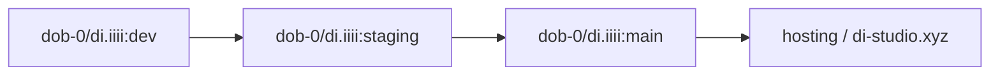

# Repository Visibility And Mirror Status

This document replaces the old "private dev + public mirror" model.

## Current Reality

- Primary repo: [dob-0/di.iiii](https://github.com/dob-0/di.iiii) (**public**, active, deploy source of truth)
- Legacy mirror: [dob-0/di.i](https://github.com/dob-0/di.i) (**hidden/inactive**, not part of active workflow)

## Active Workflow

## Rules

- Treat `dob-0/di.iiii` as the only active collaboration lane.
- Keep deployment automation and release branches in `di.iiii`.
- Do not treat `dob-0/di.i` as active source-of-truth, issue lane, or release lane.
- If `di.i` is reused later, define a new explicit policy first.

## Legacy Note

Any references in older docs to "private working repo" vs "public mirror repo" are historical and should be interpreted using the current reality above.
